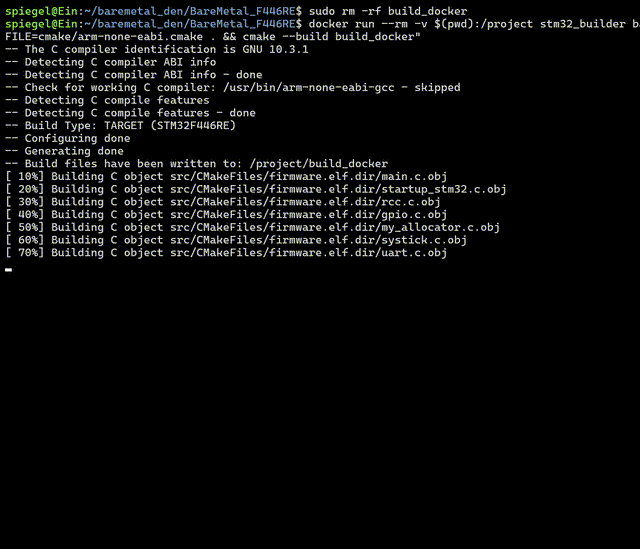

# BareMetal_F446RE: STM32F4 Driver Suite



This is a complete **Bare-Metal Driver Suite** for the STM32F446RE microcontroller, written entirely from scratch in C.

It bypasses vendor libraries (HAL/LL) to interact directly with hardware registers, demonstrating a deep understanding of computer architecture and embedded systems.

## 🚀 Key Features

* **No HAL / No Standard Peripheral Lib:** Every driver is written by reading the RM0390 Reference Manual and mapping memory addresses manually.
* **Register-Mapped Architecture:** Uses custom C structures to map peripheral registers (e.g., `RCC->CR`), mimicking the hardware layout exactly.
* **Advanced Memory Management (CCM RAM):**
    * Utilizes the **64KB Core Coupled Memory (CCM)** for the Heap, leaving main SRAM free for DMA operations.
    * Includes a custom implementation of `malloc` and `free` (`my_allocator.c`) to manage this specialized memory region.
* **High Performance:** System clock manually configured to **180 MHz** (Maximum PLL speed) with correct Flash wait states and Voltage Scaling.
* **Robust Drivers:**
    * **UART:** Non-blocking I/O with safety timeouts to prevent system hangs.
    * **Flash:** Internal memory manipulation (Unlock, Erase, Write) for persistent storage.
    * **CRC:** Hardware-accelerated cyclic redundancy checks for data integrity.
* **Professional Toolchain:** Built with **CMake**, **Docker**, and **GCC-ARM**, ensuring a reproducible build environment across any OS.

## 🛠️ Technology Stack

| Category | Tool/Standard |
| :--- | :--- |
| **Hardware** | STM32F446RE (Nucleo-64) |
| **Language** | C (C11) |
| **Build System** | CMake |
| **Compiler** | `arm-none-eabi-gcc` |
| **Environment** | Docker (Ubuntu 22.04) |
| **Style** | clang-format (LLVM) |

---

## 📂 Project Structure

```text
.
├── CMakeLists.txt       # Root Build Script
├── Dockerfile           # Reproducible Environment
├── README.md
├── LICENSE              # MIT License
├── cmake/
│   └── arm-none-eabi.cmake # Toolchain Definitions
├── include/             # Hardware Register Maps
│   ├── rcc.h            # Reset & Clock Control
│   ├── gpio.h           # General Purpose I/O
│   ├── uart.h           # Serial Communication
│   ├── flash.h          # Internal Flash Controller
│   ├── crc.h            # CRC Calculation Unit
│   ├── systick.h        # System Timer
│   └── my_allocator.h   # Custom Heap Manager
├── src/                 # Driver Implementations
│   ├── main.c           # Integration Tests
│   ├── rcc.c
│   ├── gpio.c
│   ├── uart.c
│   ├── flash.c
│   ├── crc.c
│   ├── my_allocator.c   # Custom Malloc/Free implementation
│   └── startup_stm32.c  # Vector Table & Reset Handler
└── linker/
    └── stm32f446re.ld   # Custom Memory Map (Maps Heap to CCM)
```
---

## How to Build

This project uses Docker to ensure the build works on any machine (Windows/Linux/Mac) without installing tools locally.

### Docker Build (Recommended)

This is the easiest and most reliable way to build, as it matches the CI environment.

1.  **Build the Docker image (One time setup):**
    ```bash
    docker build -t stm32_builder .
    ```
2.  **Compile the Firmware:**
    ```bash
    docker run --rm -v $(pwd):/project stm32_builder bash -c \
    "cmake -B build_docker -DCMAKE_TOOLCHAIN_FILE=cmake/arm-none-eabi.cmake . && \
    cmake --build build_docker"
    ```
3. **Flash to Board**
    ```bash
    docker run --rm --privileged -v /dev/bus/usb:/dev/bus/usb -v $(pwd):/project stm32_builder bash -c \
    "openocd -f interface/stlink.cfg -f target/stm32f4x.cfg -c 'program build_docker/src/firmware.elf verify reset exit'"
    ```
---
## 🛠️ Technology Stack & Workflow

| Driver | Status | Description |
| :--- | :--- | :--- |
| RCC | ✅ Done | PLL Config (180 MHz), AHB/APB Prescalers. |
| GPIO | ✅ Done | Mode, Output Type, Speed, Pull-up/down, AF. |
| SysTick| ✅ Done | Millisecond blocking delays, Interrupts. |
| UART | ✅ Done | STX/RX, Baud Rate Calculation, Timeout Protection. |
| Flash | ✅ Done | Sector Erase, Program (Write), Error Handling. |
| CRC | ✅ Done | Hardware CRC32 Calculation. |

---

##  How to Contribute

1.  **Fork** the repository.
2.  Create a Feature Branch (`git checkout -b feat/AmazingFeature`).
3.  Commit your changes (`git commit -m 'Add some AmazingFeature'`).
4.  Push to the Branch (`git push origin feat/AmazingFeature`).
5.  Open a **Pull Request**.

##  License

Distributed under the MIT License. See `LICENSE` for more information.

---
**Author:** Gajavelly Sai Suraj

**Contact:** saisurajgajavelly@gmail.com
